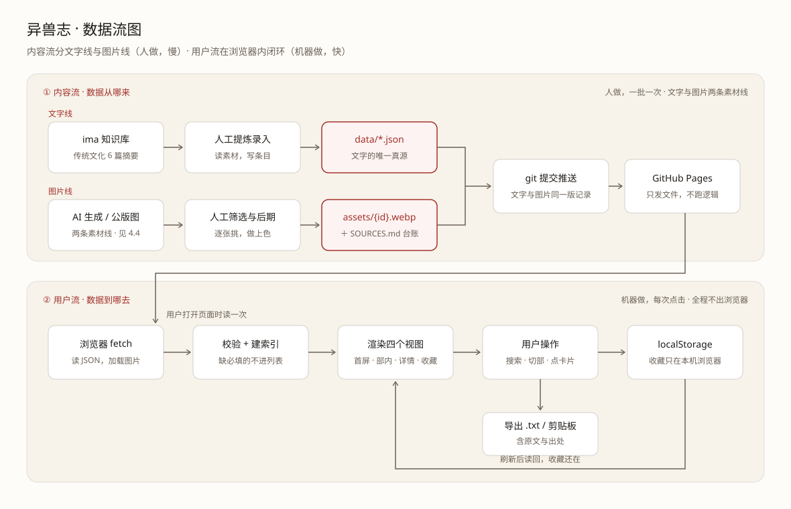
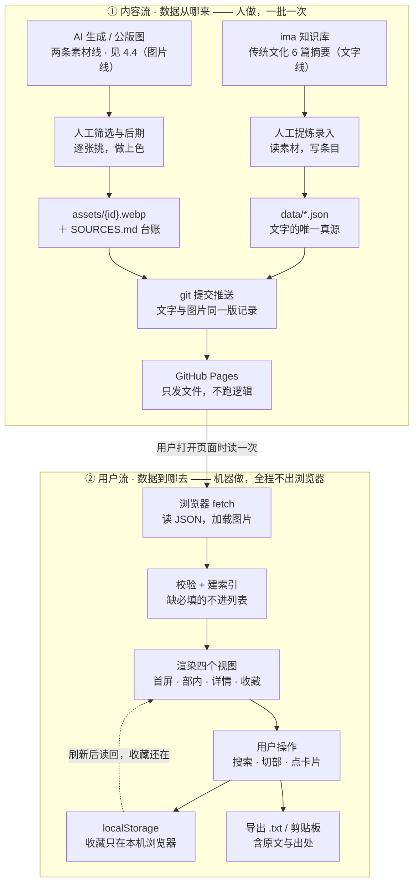

# TECH_DESIGN · 异兽志

> Day 5 产出 ｜ 2026-09-20 ｜ 版本 v1.2
> 项目：vibe-coding-100 ｜ 阶段：五步工作流第 3 步（技术方案）
> 上游文档：`PRD.md`（Day 4）· `research.md`（Day 3）· 知识库《00-异兽志·项目草案总纲》v1.1
> 代码位置：`yizhi/`
> 一句话：**用一句话说清数据从哪来、到哪去。**

---

## 0. 一句话技术方案

**文字素材从知识库人工录入 `data/*.json`、图片素材（AI 生成 / 公版古籍图）人工存入 `assets/`；页面打开时浏览器把 JSON 与图片读走、渲染成五个视图；收藏只写回浏览器自己的 `localStorage`；整站由 GitHub Pages 发文件。没有后端、没有数据库、没有密钥、没有构建工具。**

---

## 1. 三层分工与本站的取舍

### 1.1 三层各管什么

| 层 | 跑在谁的机器上 | 管什么 | 本站 |
|---|---|---|---|
| **前端** | 用户的浏览器 | 页面、样式、交互，把数据渲染成看得见的样子 | ✅ **要** |
| **后端** | 服务器的机器 | 收请求、算结果、判权限，用户看不到也改不了 | ❌ 不要 |
| **数据库** | 服务器的硬盘 | 数据长期存着，多用户多设备看到同一份 | ❌ 不要 |

**判断口诀**：这东西**要不要在别人的机器上留一份、给不止一个人看**？

| 需求 | 要后端+DB？ | 本站对应 |
|---|---|---|
| 内容是固定古籍原文，谁看都一样 | ❌ 当静态文件发出去就行 | 五部 JSON |
| 搜索、筛选、切换视图 | ❌ 浏览器自己算得动（几十~几百条） | F1 F2 |
| 收藏，但只给自己看 | ❌ 存浏览器本地 | F5 localStorage |
| 收藏要在手机和电脑之间同步 | ✅ 必须，得有账号 + 服务器存 | 本版砍掉 |
| 用户能发内容、评论、点赞 | ✅ 必须 | 本版砍掉 |

### 1.2 三层「替代品」

| 正常网站的层 | 异兽志用什么顶替 |
|---|---|
| 数据库 | `data/*.json` 静态文件 —— 数据跟着页面一起下发 |
| 后端 | 浏览器里的 `js/*.js` —— 搜索/筛选/收藏逻辑全在本地跑 |
| 服务器 | GitHub Pages —— 只负责把文件发出去，不执行任何逻辑 |
| 用户数据 | `localStorage` —— 存在用户自己浏览器里 |

### 1.3 代价（诚实列出，不藏）

1. **收藏不跨设备**：换电脑、换浏览器、清缓存 → 收藏丢失。
2. **内容改不了**：想加一条异兽，得改 JSON 再重新部署；用户在页面上改不了任何东西。
3. **搜索引擎收录弱**：纯前端渲染的内容，收录效果不如服务端渲染的站。
4. **首屏要等 JSON**：数据不是写死在 HTML 里的，加载完才渲染（本版数据量小，实际感知不到）。

**回头加后端的条件**：用户明确要跨设备同步收藏 / 要做 UGC / 要开运营后台改数据。在此之前加后端 = PRD 第 7 节判的「太早」。

---

## 2. 技术路线 A/B 对比

### 2.1 两个方案是什么

**方案 A · 纯静态原生**

```
HTML + CSS + 原生 JS（ES Module）+ JSON  →  GitHub Pages
```
不用框架、不用构建工具、不装任何 npm 依赖。

**方案 B · 加后端（收藏可跨设备）**

```
同一套前端  →  云函数（Serverless API）  →  云数据库
                    ↑
              账号登录（GitHub OAuth）
```
需要注册云平台账号，前端多出登录与请求逻辑。

### 2.2 四维度对比

| 维度 | 方案 A · 纯静态原生 | 方案 B · 加后端 |
|---|---|---|
| **学习成本** | HTML/CSS/JS 三件套 + `fetch` 读 JSON + `localStorage` 存取。全是浏览器内置能力，无工具链、无依赖安装，改完刷新即见效果 | A 的全部 **再加**：HTTP 请求与异步、鉴权与 token、CORS、数据库表设计、环境变量管理、两个平台的部署流程。学习量约 3–4 倍 |
| **线上持久化** | ❌ 无。数据只在用户本机本浏览器，清缓存即失，换设备即失 | ✅ 有。数据存云数据库，登录后跨设备、跨浏览器可见 |
| **费用** | **0 元**。GitHub Pages 对公开仓库免费，无流量限制的门槛（软限制 100GB/月，个人站远够） | 免费额度内 0 元，但**前提是新注册云平台账号**；超量按量计费；免费实例可能休眠导致首次访问慢。具体额度未实测，不做结论 |
| **排错难度** | 低。出错只可能在一处——浏览器与本地文件；F12 控制台直接给出行号；本地双击就能复现 | 高。故障点分散在浏览器／网络／云函数／数据库四处，要跨两个平台翻日志；多出 CORS、密钥泄漏、额度耗尽三类新故障；本地复现要先起本地服务 |

### 2.3 推荐：方案 A

**理由（按权重排序）**：

1. **PRD 8.6 验收标准直接否掉了 B**。原文要求「本地双击能打开，**不需要联网、不需要登录**」。方案 B 的收藏功能依赖在线服务与登录，这一条过不了。
2. **需求未验证，不该为它付成本**。PRD 第 7 节已判「账号体系、登录、收藏同步 = 太早」。加后端是为一个还没被用户提出的需求先花掉学习与运维成本。
3. **数据量与交互复杂度都在浏览器能力范围内**。全站不足 110 条、纯读操作、无并发写入，浏览器完全算得动。上后端属于「明明一把螺丝刀能拧，非要买台电动起子」。
4. **资源盘点只有一个 GitHub 账号**。方案 A 零成本零新增账号；方案 B 每个环节都要新注册、新配置。
5. **本周的学习目标是掌握前端三件套**。先用原生把 HTML/CSS/JS 的手感练出来，是后面判断框架「好在哪里」的前提。跳过原生直接上框架，属于跳过基本功。
6. **出问题能自己查**。一个人的项目，「出错只在一处、F12 就能定位」比「功能更全但要跨平台排查」重要得多。

### 2.4 方案 B 的触发条件（不是永久否决）

| 触发条件 | 说明 |
|---|---|
| 用户明确反馈「收藏丢过 / 想在手机上接着看」 | 需求从真实用户来，不是设想 |
| 本地版已验证成立（M6 五部全通之后） | 前置条件成立才谈架构升级 |
| 需要统计谁在用、查了什么 | 需要服务端才拿得到 |
| 需要让用户提交条目（UGC） | 需要鉴权与审核 |

**升级时的改造成本可控**：见第 12.5 节——只有数据层与收藏层两个文件要改，视图层不动。

> 📄 **详细预备方案已单独成文**：`TECH_DESIGN-后端预备方案.md`（草案 v0.1，**未启用**）。内含三种后端形态对比（推荐「托管数据库 + 第三方登录」）、数据表设计、前端改动点、迁移步骤、安全红线、停用回滚办法。
> **它不是本版计划的一部分**：不启用时是一份死文件，可直接删除，不影响任何代码。

### 2.5 本次不出多方案并行实现

按「卡住降级」原则：今天只产出**定案 + 理由**，不并行搭两套。方案 B 只用表格记录成本量级，不写代码、不做原型。

---

## 3. 技术栈清单

| 项 | 用什么 | 版本要求 | 为什么是它 |
|---|---|---|---|
| 结构 | HTML5 | — | 原生，无需选型 |
| 样式 | 原生 CSS（含 CSS 变量、`clamp()`、`@media`） | 支持 CSS 变量的现代浏览器 | 全站三色靠 `tokens.css` 一处管住；不引 preprocessor |
| 脚本 | 原生 JavaScript，**ES Module** | ES2020+（Chrome/Edge 90+、Safari 14+） | 用 `<script type="module">` 原生分文件，不需要打包器 |
| 数据 | JSON 文件 | — | 能被 `fetch` 直接读、能被 git 做 diff、人眼能读能改 |
| 存储 | `localStorage` | — | 浏览器内置，无账号无后端 |
| 图形 | 异兽形象图（AI 生成 / 公版古籍图）+ 自绘 SVG 装饰 | — | 形象图要求「神态惊艳」，剪影做不到；两条素材线都无版权风险（见 4.4） |
| 托管 | GitHub Pages | — | 免费、和仓库同源、推代码即发布 |
| 字体 | 系统字体栈（思源宋体/宋体 → 苹方/微软雅黑） | — | 不引 Web Font，省流量、无闪烁 |

### 3.1 明确不引入的东西

| 不引入 | 理由 |
|---|---|
| Vue / React 等框架 | 视图逻辑简单（4 个视图），框架收益小于学习成本；PRD 未要求 |
| Vite / Webpack 等构建工具 | 原生 ES Module 已能分文件；多一层工具链就多一层排错对象 |
| npm 依赖 | 本版没有任何功能需要第三方包 |
| 第三方动画库 | F4 转场用 CSS 分层 + `transition` 足够（PRD F4 明确「不引第三方动画库」） |
| 网络图片 / 图库 | 版权与风格都不可控，**仍然不搬运**（PRD 第 7 节「搬运网络图片 = 会偏」）。素材改为**自产**：AI 生成 + 公版古籍图，见 **4.4** |
| CSS 框架（Tailwind 等） | 三色约束靠 few 个变量即可守住，引入原子类反而难以管住配色 |

---

## 4. 项目结构

### 4.1 现有结构

```
vibe coding打卡学习/            ← 仓库根目录
├── AGENTS.md                   ← 协作规则（Day 2）
├── research.md                 ← 调研结论（Day 3）
├── PRD.md                      ← 功能范围/数据模型/验收（Day 4）
├── TECH_DESIGN.md              ← 本文档（Day 5）
├── index.html                  ← 仓库首页（Day 2）
├── checkin/                    ← 每日打卡流水（另一条线，与本项目无关）
└── yizhi/                      ← 异兽志代码真源，Day 7 起在这里写
    ├── index.html              ← 唯一页面，四个视图都在里面
    ├── css/
    │   ├── tokens.css          ← 设计令牌：三色、字体、版式、纸纹、动效 ✅ 已有
    │   └── base.css            ← 基础排版与布局 ✅ 已有（骨架）
    ├── js/                     ← 待建（见 4.2）
    ├── data/
    │   └── yishou.json         ← 异兽部数据，当前为空 `[]`（M1 灌 12 条）
    ├── svg/
    │   └── .gitkeep            ← 自绘矢量装饰目录（转场元素 / 纹样 / 图标）
    ├── 预览/
    │   └── 卡片样式v1.html      ← 样式试验快照（非发布内容）
    └── 云中仙槎转场方案.md       ← F4 分镜方案（文档，非发布内容）
```

### 4.2 规划结构（Day 7 起逐步建，不在今天建）

```
yizhi/
├── index.html
├── css/
│   ├── tokens.css              ← 令牌层：只管「这站什么气质」
│   ├── base.css                ← 页面层：排版、容器、留白
│   └── views.css               ← 四视图专属样式（网格/谱系树/时间轴/竖轴）
├── js/
│   ├── main.js                 ← 入口：启动、装配、事件绑定
│   ├── data.js                 ← 数据层：读 JSON、校验字段
│   ├── search.js               ← 检索层：建索引、别名匹配、排序
│   ├── store.js                ← 收藏层：localStorage 读写、导出文本
│   ├── transit.js              ← 转场层：F4 云中仙槎，可中断
│   └── views/
│       ├── grid.js             ← V1/V2 异兽图鉴网格 + 吉凶筛选
│       ├── tree.js             ← V2 神仙谱系树
│       ├── timeline.js         ← V2 神话时间轴
│       ├── groups.js           ← V2 妖怪六类分组
│       ├── axis.js             ← V2 境界竖轴 + 双序列开关
│       ├── detail.js           ← V3 详情面板
│       └── favlist.js          ← V4 收藏列表
├── data/
│   ├── yishou.json             ← 异兽部
│   ├── shenxian.json           ← 神仙部（M6）
│   ├── shenhua.json            ← 神话部（M6）
│   ├── yaoguai.json            ← 妖怪部（M6）
│   └── jingjie.json            ← 境界部（M5）
├── assets/                     ← 异兽形象图（AI 生成 / 公版古籍图）★ 见 4.4
│   ├── yishou-001.webp         ← 文件名 = 条目 id，扩展名统一 webp
│   └── SOURCES.md              ← 来源台账：记工具+日期+提示词，或书名+版本+卷次
└── svg/
    └── {用途}.svg               ← 自绘矢量装饰：转场元素 / 纹样 / 图标（不放形象图）
```

### 4.3 命名与纪律

| 规矩 | 说明 |
|---|---|
| **数据文件按部分** | 每部一个 JSON，文件名用拼音（ASCII），不用中文 |
| **中文变量名允许出现在 JS 里** | 与 PRD 字段名保持一致，读代码即读文档；但**文件名一律 ASCII** |
| **资产引用一律相对路径** | 写 `css/base.css`，**不写** `/css/base.css`（部署在子路径下绝对路径会断） |
| **`预览/` 与 `.md` 不进发布目录** | 属于过程文件，发布时排除（见第 11.3 节） |
| **代码只在 `yizhi/` 改** | 知识库里的 `预览/` 只是快照，两边同时改必冲突（总纲规矩） |
| **形象图文件名 = 条目 id** | `assets/yishou-001.webp` ↔ `{ "id": "yishou-001" }`，人眼可对、脚本可查 |
| **图片扩展名统一 webp** | 体积约为 png 的 1/4，浏览器全支持；公版扫描图先转 webp 再入库 |
| **图片一旦提交就进历史** | 以后换图，旧图仍留在 git 记录里 → **目录与命名先定型再提交**，不反复替换 |
| **每张图都要记来源** | 写进 `assets/SOURCES.md`：AI 生成记工具 + 日期 + 提示词，公版图记书名 + 版本 + 卷次。**来源不明的图不收** |

### 4.4 素材资产与版权口径（Day 5 定案）

> 本节回答一个问题：**异兽的形象图从哪来，凭什么能用。** 视觉怎么做（风格、版式、动效）属于 M2，本节只管素材的来路与合法性。

#### 4.4.1 为什么不能用《观山海》原图

《观山海》（杉泽绘 · 湖南文艺出版社）的观感是本站的视觉基准，但**原图不能上站**：

| 走不通的做法 | 为什么 |
|---|---|
| 直接放原图 + 右下角标注来源 | 署名**不免责**。《著作权法》第 24 条的合理使用不含「成规模转载一本插画集」；且署名反而成为「明知是他人作品」的证据 |
| 「只在社区内用，不公开」 | 本站部署在 GitHub Pages 上，**公网任何人拿到链接都能访问**，不存在「社区内」。链接一旦发出，范围即失控 |
| 「小圈子，人很少」 | 判断标准是**有没有向他人提供**，不是给了几个人。微信群传播在司法实践中同样被认定为信息网络传播 |

**关键区分**：著作权保护的是**具体表达**，不是**画风**。照着《观山海》的气质（水墨重彩、冷暖撞色、神态凌厉）做自己的图，**不构成侵权**。所以「惊艳」和「合法」不冲突。

#### 4.4.2 两条素材线（定案）

| | 主线：AI 生成 | 点缀：公版古籍图 |
|---|---|---|
| **用于** | 条目卡片与详情页的主形象图 | 详情页的「古籍原貌」小图 |
| **来源** | AI 生图工具，照 4.4.1 的画风基准生成 | 明清刻本《山海经》图（蒋应镐绘图本 / 吴任臣广注本 / 汪绂存本）、《三才图会》、《古今图书集成 · 禽虫典》 |
| **版权** | 自有 | 作者已逝 300+ 年，版权期已过，可自由使用修改 |
| **优点** | 质量可控，能达到「神态惊艳」 | 零风险；表达「这是古籍里的原始形象」，强化「可查证」的差异化 |
| **代价** | 需逐张生成与筛选，吃美术判断力 | 黑白版画线描，本身不够惊艳，需上色做旧后期处理 |

**为什么不选另外两条**：联系杉泽 / 湖南文艺出版社授权 —— 周期不确定，可能没回音，个人项目不宜押注；纯用公版图 —— 惊艳度达不到 PRD 9.2 的视觉要求。

#### 4.4.3 来源台账：`assets/SOURCES.md`

每张图入库时同步记一行，**没有台账的图不得进入仓库**：

| 文件 | 来源类型 | 来源详情 | 获取日期 |
|---|---|---|---|
| `yishou-001.webp` | AI 生成 | 工具名 + 提示词全文 | 2026-09-21 |
| `yishou-002.webp` | 公版 | 《山海经广注》清康熙刻本 · 卷次 · 页码 | 2026-09-21 |
| `yishou-003.webp` | AI 生成 | 同上 | 2026-09-21 |

这份台账的用途只有一个：**被问到「这张图哪来的」时能立刻答上来**。AI 生成图也在其中 —— 记下来是为了自证，不是为了免责。

#### 4.4.4 双图源：公开版 / 私有版（Day 6 定案）

> 4.4.1 判定的「原图不能上站」，指的是**公网可访问**的场合。宝哥要求本地保留《观山海》原图供个人欣赏，因此把图源拆成两套。**公开版仍严格按 4.4.1 与 4.4.2 执行，这一节没有放松任何一条。**

| | 公开版 | 私有版 |
|---|---|---|
| 目录 | `yizhi/assets/` | `yizhi/assets-private/` |
| 内容 | AI 生成图（主线）+ 公版古籍图（点缀） | 《观山海》扫描图 |
| 进 Git | ✅ 进（上线必需，理由见 §7.1「图片必须进仓库」） | ❌ **`.gitignore` 挡住，永不入库、永不推送到远端** |
| 台账 | `assets/SOURCES.md` | `assets-private/SOURCES.md`（记书名 + 页码） |
| 上线后谁能看 | 所有人 | 谁也看不到——文件根本不在远端 |

**图源怎么切**：两个目录**同名对应**（都叫 `<条目 id>.webp`），代码里按协议自动选，零操作：

| 打开方式 | 用哪套图 |
|---|---|
| 双击 `index.html`（`file://`） | 私有版 |
| 线上访问（`https://`） | 公开版 |

另留一个 URL 参数（如 `?图源=public`）用于覆盖，解决本地起 http server 调试时想预览公开版的情况。

**两条硬规矩**：

1. **先写 `.gitignore`，再加图**——私有图一旦被 git 跟踪过一次，即使随后删除，它仍永久留在 git 历史与远端仓库中，等于已经发出去了。
2. **私有版不得进入任何构建/部署链路**——`assets-private/` 不参与 GitHub Actions 发布，避免误上线。

#### 4.4.5 待办（M2 执行，不在今天做）

- [ ] 定画风基准：从《观山海》提炼可执行的提示词（配色 / 用笔 / 神态 / 背景），不复制任何具体作品
- [ ] 建 `assets/` 目录与 `SOURCES.md` 骨架
- [ ] 公版图源摸底：确认可下载、分辨率够、能过图鉴卡片的尺寸要求
- [ ] 首批 12 张（M1 的异兽部）先出，验收通过再批量
- [ ] 双图源落地（§4.4.4）：**先**把 `yizhi/assets-private/` 写进 `.gitignore`，**再**建目录放观山海图；随后接图源切换开关

---

## 5. 数据对象与字段

> 字面定义（字段含义、填写规则、§6 删字段的决定）以 **`PRD.md` 第 6 节**为准，本文档只从技术角度补充数据结构与用法，不重复定义规则。

### 5.1 文件级结构

每部一个 JSON 文件，文件级用对象包裹，便于记版本：

```json
{
  "schema": 1,
  "部": "异兽",
  "更新": "2026-09-20",
  "条目": []
}
```

| 字段 | 类型 | 用途 |
|---|---|---|
| `schema` | number | 数据结构版本号。改字段时递增，用于将来写迁移说明（本版为 `1`） |
| `部` | string | 该文件属于哪一部（五选一），用于交叉校验，防止文件放错 |
| `更新` | string | 该文件最后修改日期（`YYYY-MM-DD`），人工填写 |
| `条目` | object[] | 条目的数组，每条结构见 5.2 |

> ⚠️ **本决定由 Day 5 定**（PRD 第 6 节只定义了单条结构，未规定文件级包装）。如果要改，在验收时提出。

### 5.2 单条字段（技术视角）

| 字段 | 类型 | 必填 | 技术用途 | 缺失时的行为 |
|---|---|---|---|---|
| `id` | string | ✅ | 唯一键。**收藏存的就是它**。格式 `{部拼音}-{三位序号}`，如 `yishou-001` | 该条不进入列表，控制台警告 |
| `部` | string | ✅ | 归属校验 + 决定渲染哪种视图形态 | 同上 |
| `名` | string | ✅ | 卡片主标题；检索最高权重 | 同上 |
| `别名` | string[] | ✅（可为空数组） | **检索索引的来源**。「妲己」→ 九尾狐靠它 | 视为空数组，检索跳过 |
| `吉凶` | string | ✅（A–D 部） | **筛选的唯一依据**。四值枚举：吉祥 / 凶恶 / 灾祸 / 无害 | 该条不进筛选结果，但仍可搜到 |
| `原文` | string | ✅ | 详情引文块；导出内容的组成部分 | 该条不进入列表 |
| `出处` | string | ✅ | 必须「书名 · 卷篇」；导出内容的组成部分 | 同上 |
| `写小说怎么用` | string | ✅ | 导出内容的组成部分。**为空 = 数据不合格** | 同上（这是筛选器，不是可选项） |
| `译文` | string | ⛔ | 与原文分行渲染，视觉上必须区分开 | 页面明示「此条暂无译文」，不留空白 |
| `兆` | string | ⛔ | 独立小行展示（如「见则其邑大水」） | 整块不渲染 |
| `异说` | object[] | ⛔ | **数组非空才渲染异说区块**，并加「说法不一致」标注 | 整块不渲染（不出现空区块） |
| `关键词` | string[] | ⛔ | 检索补充权重，**不参与筛选** | 视为空数组 |
| `图` | string | ⛔ | 对应 `assets/{值}.webp`（命名与来源口径见 **4.4**） | 渲染兜底占位框，不显示破图标 |

**枚举值（写代码时按这个校验）**：

```js
const 部枚举   = ['神仙', '神话', '异兽', '妖怪', '境界'];
const 吉凶枚举 = ['吉祥', '凶恶', '灾祸', '无害'];   // A–D 部适用；E 部无此字段
```

**`异说` 子结构**：

| 字段 | 类型 | 必填 | 说明 |
|---|---|---|---|
| `出处` | string | ✅ | 谁说的 |
| `说法` | string | ✅ | 说了什么 |

写作纪律见 PRD 第 6 节（只记事实差异，不做考据结论）。

### 5.3 id 前缀表（Day 5 定）

| 部 | 前缀 | 示例 |
|---|---|---|
| 神仙 | `shenxian-` | `shenxian-001` |
| 神话 | `shenhua-` | `shenhua-001` |
| 异兽 | `yishou-` | `yishou-001`（PRD 已用此格式） |
| 妖怪 | `yaoguai-` | `yaoguai-001` |
| 境界 | `jingjie-` | `jingjie-001` |

⚠️ **id 一旦被收藏引用就不能改**，改 id 等于让旧收藏失效。要改名改内容，留着 id 不动。

---

## 6. 接口清单

### 6.1 本版没有 HTTP API

**明确声明：本站没有任何网络接口、没有请求别的服务器、没有对外提供的 API。**

原因：没有后端就不存在「接口」这一层。浏览器唯一的网络行为是**读自己站内的 JSON 文件**（同源、静态、只读）。

**什么条件下会出现真 API**：加后端时（第 2.4 节的触发条件），届时才会出现例如 `GET /api/favorites`、`POST /api/favorites` 这类接口。本版不预留、不占位、不写假的。
具体怎么加，见 `TECH_DESIGN-后端预备方案.md`（草案，未启用）。

### 6.2 模块级接口（这才是本版要定清的「接口」）

前端各模块之间的函数契约。**Day 7 起写代码按这份契约实现**，模块内部怎么改都可以，跨模块调用只认这些签名。

**数据层 `js/data.js`**

```js
loadBu(部名)  →  Promise<条目[]>       // 读 data/{前缀}.json；失败抛 {code, 部名, 原因}
loadAll()     →  Promise<条目[]>       // 五部合并（仅检索需要全量时调用）
校验条目(条目) →  {通过: boolean, 缺项: string[]}   // 缺必填项即不通过
```

> 设计取向：**按需加载**。进站默认只加载异兽部，切部才加载该部——避免一次拉五份。

**检索层 `js/search.js`**

```js
buildIndex(条目[])  →  Index                    // 把 名/别名/关键词 建成倒排索引
query(Index, 输入)   →  {直接命中[], 相近[]}      // 直接命中按权重：名 > 别名 > 关键词
```

> 空结果时必须给 `相近[]`（PRD 9.2 要求「零结果不给死胡同」）。

**收藏层 `js/store.js`**

```js
const KEY = 'yishou.fav.v1';   // key 带版本号，见 12.3
list()          →  string[]             // 收藏的 id 列表
has(id)         →  boolean
toggle(id)      →  boolean              // 返回切换后的状态
remove(id)      →  void
exportText(条目[]) → string             // 生成导出文本：名 + 原文 + 出处 + 写小说怎么用
复制到剪贴板(文本) → Promise<boolean>
下载txt(文本)    →  void
```

**视图层 `js/views/*.js`**

```js
renderGrid(容器, 条目[], 筛选态)     // V1/V2 异兽网格
renderTree(容器, 条目[])             // V2 神仙谱系树（两级）
renderTimeline(容器, 条目[])         // V2 神话时间轴（六类型分段）
renderGroups(容器, 条目[])           // V2 妖怪六类分组
renderAxis(容器, 条目[], 序列)       // V2 境界竖轴；序列 = '真丹道' | '网文'
renderDetail(条目)                   // V3 详情面板 → 返回 <dialog class="detail"> 节点（只画，不打开）
renderFavList(容器, 条目[])          // V4 收藏列表 → 返回画出的条数
```

> **M4 补记（09-22）**：`renderDetail` 的返回值与两个配套导出，是 Day 7 写代码时按装配需要定的：
> ```js
> renderDetail(条目)        →  HTMLDialogElement      // 面板节点，何时 showModal 由 main.js 决定
> 设收藏态(面板, 已收藏)     →  void                   // 同步收藏按钮的文字与 aria-pressed
> 写提示(面板, 文本)         →  void                   // 面板底部那行提示（已收藏 / 复制成功 / 没存上）
> ```
> 为什么不让 `renderDetail` 自己去问 store：「这条收藏了没有」是**状态**，不是**内容**；
> 面板一旦 import `store.js`，将来收藏改走后端就要来改这个文件（§12.5 那条纪律）。

**`js/events.js`（视图层 ⇄ 装配层之间的事件名）**

视图层的按钮**只派发不执行**，装配层在 `document` 上收。事件名集中在这一个文件里：

```js
打开请求  '打开请求'    // detail 里点了什么、或 fav 列表点条 → 请打开这一条（要播转场）
关闭请求  '关闭请求'    // 「收起」按钮
收藏切换  '收藏切换'    // 收藏 / 取消收藏 → 由 main 调 store.toggle
导出请求  '导出请求'    // detail.方式 = '复制' | '下载'
```

> 四个都 `bubbles: true`，所以挂在 `document` 上收得到。

**视图层的内部公共件 `js/views/portrait.js`**

不属于公开契约：出图与图源判定（§4.4.4）被网格与详情面板共用，放在这里只留一份。
`grid.js` 把 `图源` 再转出去，`main.js` 的 `import { 图源 }` 因此不用改。

**转场层 `js/transit.js`**

```js
play({onDone})  →  {中断()}     // 返回句柄，点击/滚动时可调 中断() 立即到站
```

### 6.3 一次典型调用的串法

用户搜「妲己」→ 点结果 → 收藏：

```
main.js
  → data.loadBu('异兽')            // 拿到条目数组
  → search.buildIndex(条目)        // 建索引（缓存）
  → search.query(索引, '妲己')      // 命中（靠 别名 里的「妲己」）
  → transit.play() → views.renderDetail(条目)
  → store.toggle(id)               // 写 localStorage
  → views.renderFavList()          // V4 里能看到
```

---

## 7. 数据流

全站只有**两条流**，一读一写。

### 7.1 内容流（只读，慢，人做）

素材从来源到用户屏幕，中间只有一次人工搬运。素材有**两条**：文字与图。

```
【文字线】
ima 知识库《传统文化》6 篇摘要 → 人工阅读提炼 → 写进 data/*.json → git 提交 → GitHub Pages 发布 → 用户浏览器读走
     （原始素材）             （M1 起逐条录）  （唯一真源）      （版本记录）  （只发文件）        （fetch 拿到）

【图片线】
AI 生成 / 公版古籍图 → 人工筛选与后期 → assets/{id}.webp + SOURCES.md → git 提交 → 随站点一起发布
  （两条素材线，见 4.4）（M2 起逐条补）  （与条目 id 一一对应）    （来源台账）  （图片必须进仓库）
```

- **文字源头**：ima 库 `3-Resources/传统文化` 下的 6 篇摘要（上古神话 / 山海经异兽 / 妖怪文化 / 道教神仙体系 / 网文修仙体系 / 传统文化素材地图）。
- **图片源头**：AI 生成 + 公版古籍图两条线，版权口径见 **4.4**。
- **这一步不能自动化**。条目里的「写小说怎么用」「异说」需要人的判断，脚本产不出来（PRD 9.3：先深后广）；图片的筛选与后期同理。
- **JSON 是唯一真源**。改文字内容只改 JSON，改完提交，不用管别的。
- **图片必须进仓库**。本站是公网部署，图片不在仓库里，Pages 上就是裂图。

### 7.2 用户流（读写，快，浏览器内完成）

用户的一次操作全程不出浏览器：

```
用户输入 / 点击
   → main.js 分发
   → data.js 已有数据（首次进站时已读）
   → search.js 检索 或 视图层渲染
   → 屏幕更新
   → 若点了收藏：store.js 写 localStorage
   → 下次打开：store.js 读 localStorage → 收藏还在
```

- **没有任何一步离开用户设备**，所以不需要联网、不需要登录（PRD 8.6）。
- 收藏的闭环靠 `localStorage`：**写进去 → 刷新 → 读出来**。这一条就是 F5 验收。

### 7.3 两条流的接口在哪

| | 内容流 | 用户流 |
|---|---|---|
| 谁在动 | 人（录入） | 机器（浏览器） |
| 多久一次 | 一批一次（M1 一次 12 条） | 每次点击 |
| 交汇点 | `data/*.json` 与 `assets/` | — |
| 出错的后果 | 用户看到旧内容或空状态 | 当前操作无反应 |

> 数据流图见 **第 8 节**。

---

## 8. 数据流图

### 8.1 图（独立文件，任何 Markdown 预览器都能看到）



> 源文件：`TECH_DESIGN-数据流图.svg`（矢量图，可任意放大截图）。内容流在图上画成**两条平行线**（文字线 / 图片线），到 `git 提交推送` 处汇合。

### 8.2 同一张图的 Mermaid 版（GitHub 上会自动渲染）



### 8.3 怎么读这张图（回答"从哪来、到哪去"）

**数据从哪来 —— 文字与图片两条素材线，都要人手过一遍：**

| 来源 | 提供什么 | 谁负责 |
|---|---|---|
| **ima 知识库**《传统文化》6 篇摘要 | 原文、出处、异说的原始素材（文字线） | 已有资产，Day 3 起就在用 |
| **AI 生成 / 公版古籍图** | 异兽形象图：卡片与详情页主图 + 「古籍原貌」小图（图片线） | 素材双线，口径见 **4.4** |
| **人工提炼与筛选** | 文字：写成合规条目（补「写小说怎么用」这类要人判断的内容）；图片：逐张挑、做后期、记来源 | **必须人做**，脚本产不出来 |

**数据到哪去 —— 三个去处：**

| 去处 | 什么时候 | 能活多久 |
|---|---|---|
| **屏幕上的四个视图** | 每次打开页面 | 关掉就没了（随时可重建） |
| **用户浏览器的 `localStorage`** | 用户点「收藏」 | 直到用户清缓存 / 换设备 |
| **导出的 `.txt` / 剪贴板** | 用户点「导出」 | 永久（内容脱离网站独立存在） |

**一句话版本**：
> 文字素材从知识库来、图片素材从 AI 生成与公版古籍图来，两条线都经人手整理成 `data/*.json` 与 `assets/`，推上 GitHub 后由 Pages 发给浏览器，浏览器把它渲染成画面；用户的收藏往回写进浏览器自己的存储里，导出时脱离网站变成一份纯文本。

**三个关键判断（都体现在图上）：**

1. **图上没有「服务器」框**。GitHub Pages 只发文件，不执行任何逻辑——这是方案 A 与方案 B 在图上最直观的区别（方案 B 会在 Pages 和浏览器之间多出「云函数 + 数据库」两个框）。
2. **用户流是一个闭环**：`渲染 → 用户操作 → 收藏 → 刷新 → 渲染`。这个环闭合在浏览器内部，是 F5（收藏与导出）验收的全部内容。
3. **唯一的跨流箭头只有一条**：Pages → 浏览器，标注「用户打开页面时读一次」。也就是说**用户访问时网站不写任何东西回服务器**——没有写接口，就没有被写坏的可能。

---

## 9. 错误处理

**总原则**：出错时给**人能看懂的一句话 + 一个能点的出路**，不白屏、不弹 `alert()`、不用假数据顶替。

| # | 场景 | 怎么发现 | 怎么处理 | 用户看到 | 不做什么 |
|---|---|---|---|---|---|
| 1 | JSON 请求失败（404 / 离线 / 路径大小写不对） | `fetch` 返回 `!ok` 或 catch 到错误 | 该部进入空状态，给「重试」按钮 | 「异兽部数据没读到，点这里重试」 | 不白屏、不弹 alert |
| 2 | JSON 解析失败（逗号、引号写错） | `JSON.parse` 抛错 | 同上，控制台打出原始错误与文件名 | 同 1 | 不用假数据顶替 |
| 3 | 条目的必填字段缺失 | 加载后跑 `校验条目()` | 该条**不进列表**，控制台警告哪条缺哪项；其余条目正常渲染 | 看不到这条 | 不渲染半截卡片、不猜内容 |
| 4 | 可选项缺失（译文 / 兆 / 异说） | 同上 | 明示缺项 | 「此条暂无译文」；异说整块不出现 | **不留空白、不出现空区块**（PRD 8.3/9.2） |
| 5 | `别名` 为空数组 | 长度判 0 | 检索时跳过该字段 | 无感知 | 不报错、不退出检索 |
| 6 | `吉凶` 值不在枚举内 | 与枚举表比对 | 视为「未分类」，不进任何筛选结果 | 该条只出现在无筛选状态 | 不猜测归入某一类 |
| 7 | `localStorage` 不可用（隐私模式 / 被禁用） | `try/catch` 包住首次读写 | 收藏降级为**内存态**（本次会话有效），浏览功能全部正常 | 顶部一行提示「本浏览器无法保存收藏」 | 不阻塞浏览、不静默失效 |
| 8 | `localStorage` 写满（QuotaExceeded） | catch 到异常 | 提示已达上限，保留已有收藏 | 「收藏已满，先取消几条」 | **不清空用户已有收藏** |
| 9 | 搜索零结果 | 命中数为 0 | 给相近条目或改字提示 | 「没找到『xx』，是不是想找：…」 | 不给死胡同（PRD 9.2） |
| 10 | 形象图缺失（`assets/{id}.webp` 不存在） | `` 的 `error` 事件 | 兜底占位框（纸色底 + 细边框，放条目标题字） | 一个安静的空框 | 不显示破图标、不显示 alt 文字外露 |
| 11 | 浏览器不支持 ES Module | 特性检测 | 显示一句提示 | 「请用较新的浏览器打开」 | 不静默白屏 |
| 12 | reduced-motion 开启 | `matchMedia('(prefers-reduced-motion: reduce)')` | 跳过转场，直接进详情 | 无动画直达 | 不强行播放（PRD 8.4） |

**控制台纪律**：所有 catch 到的问题都要 `console.error` 带上下文（哪个文件、哪条 id），否则线上/本地都没法查。

---

## 10. 环境变量

### 10.1 本版：没有

**明确声明：本版没有环境变量、没有 `.env`、没有需要保护的密钥。**

原因：
1. 没有后端 → 没有服务端配置；
2. 没有第三方服务（无统计、无地图、无 AI 接口）→ 没有 API key；
3. 唯一的「配置项」是数据文件路径，它作为常量写在 `js/data.js` 顶部即可。

```js
// js/data.js 顶部常量（不是环境变量，就是要让你看得见）
const 数据目录 = 'data/';
const 部文件 = { 神仙:'shenxian', 神话:'shenhua', 异兽:'yishou', 妖怪:'yaoguai', 境界:'jingjie' };
```

### 10.2 为什么前端用不了「环境变量」

前端代码是**公开的**——任何人打开网页按 F12 就能看到全部 JS。所以：

- 前端能放的是**公开配置**（路径、开关）；
- 前端**永远不能放密钥**（哪怕写成「环境变量」也会被打包进公开的 JS 里）。

### 10.3 什么条件下会有

| 条件 | 会出现什么 | 放哪 |
|---|---|---|
| 加后端（方案 B） | 数据库连接串、会话密钥 | 服务端环境变量，**不进代码、不进 git** |
| 接第三方接口（AI、统计） | API key | 服务端代理转发；前端只用代理地址 |
| 需要区分开发/线上行为 | 一个公开开关（如 `调试` 布尔） | 前端常量即可，不需要环境变量 |

`.env`、密钥、连接串**永远不进代码、不进提交**（AGENTS.md 第五节第 3 条）。

---

## 11. 部署

### 11.1 托管方式

| 项 | 内容 |
|---|---|
| 托管 | GitHub Pages（仓库 Public，免费） |
| 发布目录 | `yizhi/`（**不是**仓库根目录） |
| 预计地址 | `https://simple-superhero-678.github.io/vibe-coding-100/` |
| 自定义域名 | 无（资源盘点是「只有 GitHub 账号」） |
| 何时做 | M7（本版不做，Day 5 只定方案） |

**为什么发布目录是 `yizhi/` 而不是根目录**：仓库根目录还放着 `AGENTS.md`／`PRD.md`／`checkin/` 等过程文件，它们不该出现在线上网站里。按路径发布可以只放 `yizhi/` 的内容。

### 11.2 首次发布的两种做法（M7 选一个）

| 做法 | 怎么做 | 代价 |
|---|---|---|
| **A · GitHub Actions（推荐）** | 写一个 workflow，用官方 Pages 动作指定 `path: yizhi` 上传发布 | 要加一个 `.github/workflows/*.yml` 文件；但发布目录可自由指定，根目录不被污染 |
| B · 复制到根目录 | 把 `yizhi/` 里所有内容复制到仓库根目录 | 根目录被站点文件塞满，`PRD.md`／`checkin/` 混在一起，**不推荐** |

**人机分工（M7 执行时）**：workflow 文件我来写；宝哥在 GitHub 网页上点 `Settings → Pages → Source` 选 **GitHub Actions**，然后在 Actions 页看一次运行是否绿勾。这属于必须人工点的步骤，我不代做。

### 11.3 发布目录的纪律（三个必踩的坑）

| 坑 | 为什么 | 规矩 |
|---|---|---|
| **中文文件名** | `预览/卡片样式v1.html`、`云中仙槎转场方案.md` 在 GitHub Pages 上要 URL 编码，容易断链 | 发布目录内**只用 ASCII 文件名**；`预览/` 和 `.md` 都不进发布内容 |
| **大小写敏感** | Windows 本地不区分大小写，GitHub Pages（Linux）**区分** —— 本地能开、线上 404 | 引用文件时**大小写必须与磁盘完全一致**，写完自查一遍 |
| **绝对路径** | 站点可能挂在 `/vibe-coding-100/` 子路径下，`/css/base.css` 会指向域名根目录 | 一律相对路径：`css/base.css`、`data/yishou.json` |

**发布内容排除清单**：`预览/`、`*.md`、`.gitkeep` 之外的临时文件。（`assets/SOURCES.md` 是来源台账，属维护资料，同样不进发布内容）

### 11.4 每次更新怎么发

```
改 yizhi/ 里的文件  →  git commit（Day X｜一句话）  →  push  →  Pages 自动重新发布（约 1 分钟）
```

**没有构建步骤**，不需要装任何东西，推上去就是新的。

### 11.5 本地怎么看

直接双击 `yizhi/index.html` 就能打开（PRD 8.6 的要求）。
⚠️ 但 `file://` 下的问题比这里预判的更严重：**Day 7 实测，`type="module"` 的模块脚本本身就被拦，`fetch` 连发都发不出去** → 双击打开只剩空骨架（JS 一行没跑）。所以本地开发**必须**起一个极简本地服务（`python -m http.server`，命令见 `README.md`）——这是**开发时的便利**，不是发布形态；发布后走 `https://` 一切正常。

> **09-22 宝哥定：`file://` 双击这条暂缓到 M7 上线前再评估。** 让双击真能用需要放弃 `type="module"`、把数据内联或改走 JSONP，代价是 `data/*.json` 不再是唯一真源（§12.2 那条纪律会被打破）。本期不动架构。

---

## 12. 迁移与兼容注意事项

### 12.1 文件系统差异（最容易在最后一天翻车）

| 差异 | 后果 | 对策 |
|---|---|---|
| GitHub Pages 区分大小写，Windows 不区分 | 本地好、线上 404 | 提交前确认引用名与磁盘名逐字符一致 |
| 中文路径在不同系统编码不同 | 链接失效、git 显示乱码 | 发布目录内不用中文文件名 |
| Windows 换行符 `CRLF` vs `LF` | 大批无意义的 diff | 已在 `.gitignore`／git 配置中统一（Day 2 已处理，此处仅提醒别改回去） |

### 12.2 JSON 是唯一真源

- **只改 JSON，不要在页面上改**（页面是渲染结果，改了不落地）。
- `data/` 必须进 git：它是全部内容的备份，丢了就没法恢复。
- 线上没有数据库可改，所以不存在「线上改了忘了同步回本地」的问题——这是方案 A 白送的好处。

### 12.3 `localStorage` 的版本化

- key 是 `yishou.fav.v1`，**版本号写在 key 里**。
- 将来收藏的数据结构变了 → 起 `yishou.fav.v2`，旧 key 保留不动，读的时候两者合并或提示一次。**不要原地改结构试运气。**
- key 出现在代码里的位置只有 `js/store.js` 一处，改就改一处。

### 12.4 条目 id 的稳定性

- 收藏存的是 id，不是条目内容。**id 改了 = 旧收藏指向不存在的东西。**
- 渲染收藏列表时**必须校验 id 是否存在**：不存在 → 显示「此条已下架」并允许用户移除，而不是报错或静默忽略。
  > ✅ **M4 已实现（09-22）**，落点两处：`main.js` 的 `收藏条目()` 给捞不到的 id 造一条 `{已下架:true}` 占位（导出时滤掉）；`views/fav.js` 把占位画成**不可点的行** + 一颗「移除」按钮。踩过的坑：`处理收藏()` 里第一版加了「条目找不到就 return」，结果「移除」点了没反应 —— 已修，并留了注释。
- id 永不复用：删掉 `yishou-007` 后，下一个新条目用新号，不再占用 007。

### 12.5 将来升级架构时，改哪里

这是分层的意义所在：

| 升级到 | 要改的文件 | 不用动的 |
|---|---|---|
| 加后端 / 换框架（如 Vue） | `js/data.js`（改为请求 API）、`js/store.js`（改为读写服务端） | 全部 `js/views/*`、`css/*`、`index.html` 结构 |
| 数据从 JSON 改成别的格式 | `js/data.js` 一处 + 数据文件 | 视图层、收藏层 |
| 加多语言 | 视图层文案外提 | 数据层、收藏层 |

**一句话**：只要视图层不认识「数据从哪来」，换数据来源就不用重写界面。

### 12.6 数据本身的迁移

| 情形 | 怎么做 |
|---|---|
| 新增可选字段（如再加一个 `图鉴编号`） | 不动 `schema` 版本；旧条目该字段缺失即走「缺项明示」，不用批量补 |
| 改字段名 / 改必填规则 | `schema` 递增 + 在本文档补一段迁移说明（旧值怎么换算成新值）+ 手工改 JSON |
| 拆分/合并数据文件（如异兽部太多要分册） | 改 `js/data.js` 的部文件映射表 + 移动数据；视图层不动 |
| 条目内容修订（错别字、卷篇补正） | 直接改 JSON，id 不动；在 commit 信息里写清改了哪条 |

---

## 13. 与其他文档的边界

| 文档 | 管什么 | 冲突时 |
|---|---|---|
| `research.md` | 调研过程与竞品结论；引用数字以它为准 | — |
| `PRD.md` | 功能范围、数据模型字面定义、验收标准 | **以 PRD 为准** |
| `TECH_DESIGN.md`（本文） | 技术路线、项目结构、模块接口、错误处理、部署与迁移 | 本文与 PRD 冲突时改本文（PRD 是功能合同） |
| 《00-异兽志·项目草案总纲》 | 进度与里程碑 M0–M7 | 进度以总纲为准 |

**不复制原则**：本文不重复 PRD 的字段规则、验收条目、里程碑细节，只写技术决定；需要时给指向。

---

## 14. 待确认与待核实

| # | 项 | 状态 |
|---|---|---|
| 1 | 文件级包装结构 `{schema, 部, 更新, 条目[]}` | Day 5 定，待宝哥验收确认 |
| 2 | id 前缀表（`shenxian-` / `shenhua-` / `yishou-` / `yaoguai-` / `jingjie-`） | Day 5 定，待确认 |
| 3 | 发布用 GitHub Actions（而非复制到根目录） | 方案已定，M7 执行时再确认 |
| 4 | 本地开发是否需要本地服务兜底 | ✅ **已实测（Day 7）**：`file://` 下模块脚本与 `fetch` 双双被拦，双击只剩空骨架 → 本地**必须**起服务。宝哥 09-22 定：双击这条**暂缓到 M7 前再评估**（详见 §11.5） |
| 5 | 方案 B 的免费额度具体数字 | **未实测**，不当作结论使用 |
| 6 | 后端数据库是否启用 | **未定**。由宝哥在后续打卡中明确说了才算；预备方案见 `TECH_DESIGN-后端预备方案.md`（不启用可删） |
| 7 | 异兽图片素材来源与版权口径 | **已定（Day 5）**：AI 生成主线 + 公版古籍图点缀；《观山海》原图不上站，仅作视觉基准。详见 **4.4** |
| 8 | PRD §6 字段名 `svg` → `图` | Day 5 随素材口径一并修订 PRD。理由：图片已是位图，字段名不该叫 `svg`；当期 JSON 为空，零迁移成本 |

---

v1.0 · 2026-09-20（Day 5）
v1.1 · 2026-09-20（Day 5 追加）—— 新增 §4.4 素材资产与版权口径；§3、§4.1–4.3、§5.2、§7.1、§9、§11.3、§14 同步修订；PRD §6、§7.2、§10.1 同步修订
v1.2 · 2026-09-20（Day 5 追加）—— §8 数据流图改为两条素材线（文字线 / 图片线），重画 `TECH_DESIGN-数据流图.svg`；§0、§7.3、§8.1–8.3 同步
v1.3 · 2026-09-22（Day 7）—— M4 落地后的文档同步：§6.2 补记 `views/portrait.js`、`js/events.js`、`renderDetail` 的返回值与两个配套导出（`设收藏态`/`写提示`）及其理由；§12.4 补记「已下架」的实现落点与踩到的坑。**本版无新增待确认项。**
