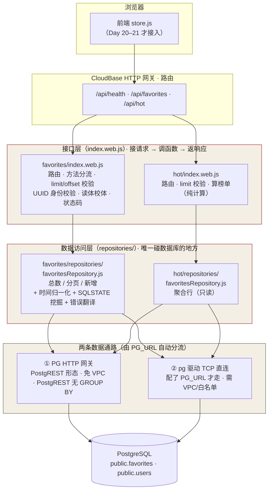

# cloudbase/ — CloudBase 后端代码（Day 15 起）

> 这里放**云函数源码**，跟站点（`yizhi/`，纯前端）分开。
> 本目录**不进** GitHub Pages 发布（发布根目录是 `yizhi/`）。

## 环境信息（2026-10-06 建）

| 项 | 值 |
|---|---|
| 环境名称 | `yishou` |
| **环境 ID** | `yishou-d9gyoykka49fb0634` |
| 地域 | 上海（ap-shanghai） |
| 套餐 | 免费体验版（3000 资源点/月，不支持加购/按量） |
| 到期 | 2027-04-06 |
| 数据库类型 | **PostgreSQL**（创建时选定，不可切换） |
| **默认域名** | `yishou-d9gyoykka49fb0634-1501173044.ap-shanghai.app.tcloudbase.com` |

## 已有云函数

| 函数名 | 路由 | 认证 | 读什么 | 说明 |
|---|---|---|---|---|
| `health` | `GET /api/health` | 否 | 不连库 | 存活探针，只回 `{"ok":true,"service":"yishou"}`（Day 15） |
| `favorites` | `GET` + `POST` `/api/favorites` | 是（临时 `user_id`） | `public.favorites` | **读**：收藏列表读取，支持 `limit`/`offset`（Day 17）· **写**：新增一条收藏（Day 18，同一个函数按方法分流） |
| `hot` | `GET /api/hot` | 否 | `public.favorites` 聚合 | 「收藏热门榜」：被收藏最多的条目 Top N（Day 17，口径见下） |

> **关于 `hot` 的名字**：清单里的「热搜」是打卡课程模板（打卡 App 示例）的说法。本项目（异兽志）没有外部热搜需求，
> Day 17 拍板把 `hot` 改口径为「**对现有 `favorites` 按 `entry_id` 聚合出的收藏榜**」——零建表、零外部数据源，读真库真行。

## 目录结构（Day 19 分层重构后）

```
cloudbase/
├── README.md                      ← 本文件
├── functions/                     ← 一个子目录 = 一个云函数（各自独立打包部署）
│   ├── health/
│   │   ├── index.js               （Event 函数版，早期留档）
│   │   ├── index.web.js           ← Web 函数版：GET /api/health，不连库
│   │   └── （无 repository —— 它压根不碰数据库）
│   ├── favorites/
│   │   ├── index.web.js           ← 【接口层】575 行 → 326 行
│   │   │                            只做：路由 / 方法分流 / 参数校验 / 读体 / 身份
│   │   │                                  → 调仓库 → 组装 {ok,data} / {ok:false,error}
│   │   ├── repositories/
│   │   │   └── favoritesRepository.js  ← 【数据访问层】★ Day 19 拆出来的新文件
│   │   │                                  所有「查数据库」的代码都在这里
│   │   ├── scf_bootstrap          （启动脚本，必须 LF）
│   │   └── package.json           （零依赖；⚠️ 不写 main）
│   └── hot/
│       ├── index.web.js           ← 【接口层】210 行 → 175 行
│       │                            聚合（算榜单）留在这层 —— 它是纯计算，不是取数
│       ├── repositories/
│       │   └── favoritesRepository.js  ← 【数据访问层】★ Day 19 拆出来的新文件
│       ├── scf_bootstrap
│       └── package.json
└── tests/
    ├── api-local-test.js          ← 本机断言（假查询者 + 假 fetch，不连库不联网）93 条
    ├── refactor-fingerprint.js    ← 【Day 19 新增】重构前后逐字节行为比对，22 例
    └── online-regress.js          ← 【Day 19 新增】线上九接口回归（真打公网地址）
```

### 「查数据库」这段代码，从哪移到了哪？

| 原来在 `index.web.js` 里的东西 | 现在在哪 |
|---|---|
| 网关基址拼接 `https://<envId>.api.tcloudbasegateway.com/v1/rdb/rest` | `repositories/favoritesRepository.js` · `建网关仓库()` |
| `Authorization: Bearer <TCB_API_KEY>` 鉴权头 | 同上 |
| `content-range` 里抠 `total`、`/favorites?select=…&order=…&limit=…` | 同上 · `总数()` / `分页()` |
| `Prefer: return=representation` 的 POST 写入 | 同上 · `新增()` |
| SQLSTATE 挖掘（`DATABASE_23505` 归一化 + `proxy-status` 兜底） | 同上 · `规范码()` / `挖SQLSTATE()` / `挖头SQLSTATE()` |
| `pg.Pool` 连接池、参数化 SQL、`to_char(... AT TIME ZONE 'UTC')` | 同上 · `建pg仓库()` |
| `PG_URL` 有无 → 选哪条通路 | 同上 · `建默认仓库()` |
| 数据库错误码 → 契约 `code` + 中文人话（读 / 写两套） | 同上 · `翻错误()` / `翻写入错误()` |
| `+08:00` → `…Z` 的时间归一化 | 同上 · `收成UTC()` |

**留在接口层的**：URL 解析、`limit`/`offset` 校验、`UUID` 身份校验、请求体读取与校验、
JSON 响应拼装、HTTP 状态码（200/201/400/401/405/409）。

> ⭐ **一句话回答今天的问题**：从 `favorites/index.web.js`（和 `hot/index.web.js`）里，
> **移到了各自同目录下的 `repositories/favoritesRepository.js`**。
> 接口层从此**不再出现任何 SQL、网关地址、连接池** —— 它只负责「接请求、调函数、返响应」。

### ⚠️ 为什么 `repositories/` 在函数目录**内部**，而不是 `cloudbase/repositories/` 共享一份

`tcb fn deploy` 只打包**当前函数目录**（这也是必须 `cd` 进去再执行的原因）。
跨目录 `require('../repositories/…')` 在**本机跑得好好的**，一上线就 `MODULE_NOT_FOUND`。
所以 `favorites` / `hot` **各持一份**同表的 repository —— 代码是重复的，但这是该部署模型下的正确取舍。

> ✅ **已验证**：`tcb fn deploy` 会把 `repositories/` 子目录一起打进代码包（Day 19 部署后线上 200，`require('./repositories/favoritesRepository.js')` 解析成功）。
> 📌 两份副本的**差异是刻意的**：`hot` 那份只读（只有 `聚合行()`），不需要 `总数`/`分页`/`新增`/SQLSTATE 挖掘 —— 别顺手「统一」成一个文件。

## 数据通路：为什么不是 `pg` 直连

Day 17 实测后的定案 —— **首选 CloudBase PG HTTP 网关，`pg` TCP 直连只作备选**：

| 通路 | 怎么走 | 代价 |
|---|---|---|
| ① **PG HTTP 网关**（默认） | `https://<envId>.api.tcloudbasegateway.com/v1/rdb/rest/<表>`，`Authorization: Bearer <环境 API Key>` | 零依赖（用内建 `fetch`）、**免 VPC/白名单**、免连接串；PostgREST 形态，**没有 GROUP BY**（`hot` 的聚合在函数里做） |
| ② `pg` TCP 直连（备选） | 配 `PG_URL` 时自动启用，`pg.Pool` + 参数化 SQL | 要装 `pg`、要连接串，按官方说法还要 **VPC + 白名单**（云函数不在库的白名单里就会 `ECONNREFUSED`） |

> 为什么换：控制台「连接信息」入口在本环境不可见，拿不到连接串；而 CloudBase 官方也把 TCP 列为「例外迁移路径」。
> 网关这条路一次就通（见下方验证记录）。两条路都留着，`PG_URL` 一配就自动切回 ②。

## 部署步骤（CloudBase CLI · 推荐 · `favorites` / `hot` · Day 17）

> 本机已装 `@cloudbase/cli`（3.8.5）且**登录态有效**（`tcb login` 会提示 `You are logged in`）。
> CLI 路径：`C:\Users\lxb07\.workbuddy\binaries\node\workspace\node_modules\.bin\tcb.cmd`

### 第 0 步：建一把环境 API Key（只做一次）

```bash
tcb env apikey create yishou-server -e yishou-d9gyoykka49fb0634 --type api_key --json
```

- `--type api_key` → 角色是 `service_role`（绕过 RLS，**只在服务端用，绝不放前端**）
- 返回里的 `ApiKey` 就是下文要用的**环境 API Key**
- 🔴 这把 Key **只填在函数环境变量里，不写进仓库、不进 Git**（AGENTS §五.3）

### 第 1 步：部署函数

🔴 **部署前必做**：自检启动脚本的换行符。**`scf_bootstrap` 必须是 LF，绝不能是 CRLF**
（Windows 上编辑器 / Git 极易把它转成 CRLF，转了就线上 443，排查能烧掉一整轮 —— 详见「已知坑」第 1 条）。

```bash
grep -qU $'\r' scf_bootstrap && echo "🔴 CRLF，先修再部署！" || echo "✅ LF"
```

⚠️ **必须 `cd` 进函数目录再执行** —— CLI 找 `scf_bootstrap` 看的是当前目录，`--dir` 只影响打包内容。

```bash
cd cloudbase/functions/favorites
tcb fn deploy favorites --httpFn --force -e yishou-d9gyoykka49fb0634 \
    --runtime Nodejs20.19 --install-dependency false
```

`hot` 同理（把两处 `favorites` 换成 `hot`）。三个文件缺一不可：

| 文件 | 作用 |
|---|---|
| `index.web.js` | Web 函数本体：自己起 `http` 服务、监听 9000 |
| `scf_bootstrap` | 平台启动脚本（`export PORT=9000; exec node index.web.js`）。**缺了 CLI 会报错并让你交互确认** |
| `package.json` | 声明 Node 工程。⚠️ **不要写 `main` 字段** —— 会被 CLI 误推断成入口 `index.web.main` |

### 第 2 步：配环境变量（密钥不进仓库的关键一步）

CLI 的 `fn deploy` 不带 `--env` 参数，环境变量走**管理接口**下发：

```bash
# 用 MCP 的 manageFunctions(action="updateFunctionConfig")：
{ "action": "updateFunctionConfig", "functionName": "favorites",
  "envVariables": { "TCB_ENV_ID": "yishou-d9gyoykka49fb0634", "TCB_API_KEY": "<第 0 步的 ApiKey>" },
  "timeout": 20 }
```

| 变量名 | 值 | 用途 |
|---|---|---|
| `TCB_API_KEY` | 第 0 步那把 ApiKey | 网关鉴权（**必填**） |
| `TCB_ENV_ID` | `yishou-d9gyoykka49fb0634` | 网关基址；不填时有默认值兜底 |
| `PG_URL` | 连接串（`postgresql://...`） | 可选：配了就走 `pg` 直连，不配走网关 |

### 第 3 步：挂路由

```bash
# 等价 MCP：manageGateway(action="createRoute", domain=…, path=…,
#                          upstreamResourceType="WEB_SCF", targetName="favorites")
```

| 上游 | 路径 | 类型 |
|---|---|---|
| 云函数 `favorites` | `/api/favorites` | `WEB_SCF` |
| 云函数 `hot` | `/api/hot` | `WEB_SCF` |

> ⚠️ HTTP 函数的类型是 **`WEB_SCF`**（不是 `SCF`）；控制台里对应的坑是「关联资源」默认选「云托管」，要手动切成「云函数」。
> 路由传播通常数秒~30 秒，别盲等 3–5 分钟。

## 分层示意图（Day 19 余力加练）



> 图中红框（朱砂）是 Day 19 划出的两层边界：**接口层不碰数据库，数据层不管 HTTP**。
> `favorites` 与 `hot` 各持一份 `repositories/`，因为云函数按目录独立打包（见上节）。

## 验证记录（Day 17 实测，2026-10-07）

```bash
/tmp/favorites?user_id=11111111-1111-4111-8111-111111111111
→ 200 {"ok":true,"data":{"total":5,"items":[{"entry_id":"yishou-001","created_at":"2026-10-01T09:12:00Z"}, …]}}

/api/hot
→ 200 {"ok":true,"data":{"total":9,"items":[{"entry_id":"jingjie-003","fav_count":1}, …]}}
```

**「改一行数据、刷新后跟着变」**（完成标准第三条）：

| 步骤 | 结果 |
|---|---|
| `UPDATE public.favorites SET entry_id='yishou-002' WHERE id='f1a00001-…-000000000001'` | `rowCount: 1` |
| 立刻刷新 `/api/favorites?user_id=1111…` | 第一条变成 `"entry_id":"yishou-002"` ✅ |
| 再 `UPDATE … SET entry_id='yishou-001'`（复原） | 刷新后回到 `yishou-001` ✅ |

> 截图在 `tmp/day17-截图/`（`tmp/` 已 gitignore，作业证据不入库）。
> ⚠️ 无头浏览器画不出**地址栏** —— 交给老师的图请在真浏览器里点开上面两条链接再截。

### Day 18 实测（2026-10-08）：写接口上线

`POST /api/favorites?user_id=11111111-1111-4111-8111-111111111111`，体 `{"entry_id":"shenxian-003"}`：

| 场景 | HTTP | 响应 |
|---|---|---|
| 正常写入 | **201** | `{"ok":true,"data":{"entry_id":"shenxian-003","created_at":"2026-10-08T…Z"}}` |
| 重复提交（同一条再来一次） | **409** | `{"ok":false,"error":{"code":"FAV_DUPLICATE","message":"该条目已在收藏中（同一用户重复收藏同一条会被拒绝）"}}` |
| 缺必填字段（体 `{}`） | **400** | `{"ok":false,"error":{"code":"BAD_REQUEST","message":"缺少必填字段：entry_id（条目 id，例如 yishou-001）"}}` |
| 体是空白串 `{"entry_id":"   "}` | **400** | `…"message":"entry_id 不能为空"` |

数据库侧核对：`SELECT … FROM public.favorites WHERE user_id='1111…' ORDER BY created_at` —— 写一次多一行，**重复请求一行都不多**；同时 `GET /api/favorites` 的 `total` 与 `SELECT count(*)` 完全一致（写进去的读得出来）。

**写测试命令的坑（本机 Windows 实测）**：⚠️ **PowerShell 里不要用 `curl.exe` 传 JSON** —— 引号会被吃掉，服务端收到非法 JSON 回 400（单引号、`\"` 两种写法都实测失败）。用 `Invoke-WebRequest`：

```powershell
$u = 'https://yishou-d9gyoykka49fb0634-1501173044.ap-shanghai.app.tcloudbase.com/api/favorites?user_id=11111111-1111-4111-8111-111111111111'
function Post($body) {
  try { $r = Invoke-WebRequest -Uri $u -Method Post -ContentType 'application/json' -Body $body -UseBasicParsing; "HTTP " + $r.StatusCode; $r.Content }
  catch { "HTTP " + $_.Exception.Response.StatusCode.value__; (New-Object System.IO.StreamReader($_.Exception.Response.GetResponseStream())).ReadToEnd() }
}
Post '{"entry_id":"shenxian-003"}'   # 201
Post '{"entry_id":"shenxian-003"}'   # 409
Post '{}'                            # 400
```

（`catch` 是必须的：PowerShell 遇到 4xx 会抛异常，不接就看不到响应体。）

## 验证记录（Day 19 分层重构 · 2026-10-08）

重构**只动结构、不动行为**。三道闸门逐级验证：

| # | 验什么 | 命令 | 结果 |
|---|---|---|---|
| 1 | 本机断言（假查询者 + 假 fetch） | `node cloudbase/tests/api-local-test.js` | **93 / 93 通过** |
| 2 | 重构前后**逐字节**行为比对 | `node cloudbase/tests/refactor-fingerprint.js` | **22 / 22 一致** |
| 3 | 重新部署后**线上真打** | `node cloudbase/tests/online-regress.js` | **9 / 9 符合预期** |

**第 2 道闸门（Day 19 新增）怎么做的**：把 Day 18 提交（`020df09`）里的两个 `index.web.js`
用 `git show` 取出来放进 `tmp/day19-基线/`，与当前重构版**各起一个本地 http 服务**，
用同一份 22 例请求清单（GET 读 / POST 写 / 参数校验 / 身份校验 / 方法分流 / 404/405/OPTIONS）
打两边，比对**状态码 + `content-type` + `cache-control` + 响应体原文**。
它比断言更贴「线上行为不变」这句话 —— 覆盖 JSON 字段顺序、错误文案、路由兜底。

**第 3 道闸门实测明细**（`tmp/day19-截图/线上返回.json` 是原始记录）：

| 接口 | HTTP | 响应 |
|---|---|---|
| `GET /api/health` | **200** | `{"ok":true,"service":"yishou"}` |
| `GET /api/favorites`（无身份） | **401** | `UNAUTHORIZED` |
| `GET /api/favorites?limit=abc` | **400** | `limit 必须是整数` |
| `GET /api/favorites?user_id=1111…` | **200** | `{"ok":true,"data":{"total":9,"items":[…]}}` |
| `GET /api/hot` | **200** | `{"ok":true,"data":{"total":13,"items":[{"entry_id":"shenxian-003","fav_count":2},…]}}` |
| `GET /api/hot?limit=2` | **200** | 同上，只 2 条 |
| `POST /api/favorites`（新条目） | **201** | `{"ok":true,"data":{"entry_id":"yishou-day19-check","created_at":"2026-10-08T12:20:47Z"}}` |
| `POST /api/favorites`（**再来一次**） | **409** | `FAV_DUPLICATE` ← 证明 SQLSTATE 挖掘链路在拆分后**完好** |
| `PUT /api/favorites` | **405** | `METHOD_NOT_ALLOWED` |

> ⚠️ 回归用例里的 `user_id` **必须是 `users` 表里真实存在的 uuid**（用 `11111111-1111-4111-8111-111111111111`）。
> 随手编一个 uuid 会被 `favorites.user_id` 的外键拦住 → 23503 → **400 `BAD_REQUEST`**。
> 这是**正确行为**（接口在告诉你「收藏要挂在真实用户上」），但会让人误以为写入坏了。

## 备选部署路径（控制台 · Web 函数）

控制台路径同样可行，代码一字不用改：**创建云函数 → 模板 HTTP 云函数 → Node.js Hello World** →
「函数代码」替换 `index.js`（这里对应仓库里的 `index.web.js`，模板自带 `scf_bootstrap` 别动）→
「函数配置 / 环境变量」加上表里那两个变量 → 保存并部署 → HTTP 网关加路由（**关联资源切到「云函数」**）。

> 两条路径**只保留一份在线上**即可，别同一函数挂两条路由。

## 本机自测（不连数据库、不装依赖、不联网）

改完 `favorites` / `hot` 的逻辑，先在**本机**把纯逻辑 + 网关请求构造跑一遍再部署：

```
"C:\Users\lxb07\.workbuddy\binaries\node\versions\22.22.2-6\node.exe" cloudbase/tests/api-local-test.js
```

期望最后一行 `==== 93 / 93 通过 ====`。它验四层：
2. **写入逻辑**（Day 18）：POST 分支的校验（缺字段 / 非字符串 / 空白 / 超 64 字）、201 形状、带约束的内存表（外键 + 唯一）复刻出 23503 / 23505
3. **聚合**：`hot` 的 `算榜单()` —— 票多在前、同票按 id 升序、limit 夹取
4. **网关通路**：用**假的 `fetch`** 捕获真实请求 URL —— 基址、`Prefer: count=exact` / `Prefer: return=representation`、`order=created_at.asc,id.asc`、`user_id` URL 编码、`+08:00 → UTC Z` 时间归一化、401 错误码映射、**SQLSTATE 归一化与响应头兜底**

⚠️ **本机自测的固有盲区（2026-10-08 栽过一次）**：假接口只会回**你想到的形状**。
当天「重复提交」用例用的假响应体是 `{code:'23505'}`，而真网关回的是 `{code:'DATABASE_23505'}`（带前缀）——
本机 88/88 全绿，一上线重复提交就回了 500。
**规矩**：凡是「对面系统给什么形状」的假设，**都要拿直连抓回来的原样文本回填断言**，别手写。

**它不验「真连库通不通」** —— 那个只有部署后打公网地址才知道。

## 已知坑

- 🔴 **第 1 坑（2026-10-08 实测，排查烧掉一整轮）：`scf_bootstrap` 的换行符必须是 LF。**
  它一旦被转成 **CRLF**（Windows 编辑器 / Git 极易自动转），容器里 bash 执行的是 `exec node index.web.js\r` —— **`\r` 被当成文件名的一部分**，node 找不到 `index.web.js\r` → **容器根本没起来** → 网关恒回 **443 + 空响应体**（`x-cloudbase-upstream-status-code: 443`）。
  **它骗人的地方**：函数状态 `Active`、配置逐字段正常、代码包下载回来看三个文件齐全且与本地逐字节一致、容器日志一行都没有（启动失败发生在 node 之前，连 `console.log` 都没机会打）。
  | 判据 | |
  |---|---|
  | 线上 **443 且响应体空** | 容器**没起来**（不是代码逻辑错 —— 逻辑错会回 **500**） |
  | 先查什么 | `grep -qU $'\r' scf_bootstrap`，别先读代码 |
  | 一行修 | `python -c "p='scf_bootstrap';open(p,'wb').write(open(p,'rb').read().replace(b'\r\n',b'\n'))"`（改完重新部署） |
  **为什么当时只有 `favorites` 中招**：`hot` 最后一次部署在 10-07 16:52（那时还是 LF），之后文件被改坏但**没再部署过**，线上跑的还是旧包 —— 也就是说 **`hot` 是一颗没引爆的地雷**，谁下次部署它谁中招（2026-10-08 已把本地文件一并修回 LF）。
  💡 **同类排障思路**（拿不到容器日志时）：造一个**极简探针函数**做**正交对照** —— 一次只变一个量（代码内容 / 体积 / 环境变量 / 换行符），挂临时路由去探，谁 200 谁 443 一目了然，比猜快得多。用完记得把探针函数和路由删净。
- 默认域名 `*.app.tcloudbase.com` **浏览器直开会先弹「页面访问提示」中间页**（按钮带 1 秒倒计时、`disabled`），点「确定访问」才见内容 —— 正常现象，不是部署失败。
  ⚠️ **要交的截图必须点掉它**，否则图里是提示页而不是接口返回。无头 Edge 可以用 CDP 点 `#submitBtn` 绕过（`tail` 见 `tmp/` 里的截图脚本）。
- ⚠️ **`tcb fn deploy` 必须 `cd` 进函数目录执行**：CLI 找 `scf_bootstrap` 看的是**当前目录**，`--dir` 只决定打包什么。在仓库根跑会报「Web function requires scf_bootstrap startup file, not found in current directory」并转成交互提问。
- ⚠️ `package.json` 里**别写 `main`**：CLI 会据此猜入口（实测猜出 `index.web.main` 这种不存在的入口）。
- ⚠️ Node 22 及以后的运行时**不支持云端安装依赖**；本函数零依赖，部署时统一带 `--install-dependency false`。
- ⚠️ 改了代码**必须重新 `tcb fn deploy`**，否则线上还是旧逻辑（排错时最容易白查一轮的地方）。
- ⚠️ 首次请求有**冷启动**（可能几秒），别当挂死；接口已回 `cache-control: no-store`，刷新拿到的一定是新数据。
- ⚠️ 网关是 **PostgREST 形态，不支持 `GROUP BY` / `count()`**。`total` 靠 `Prefer: count=exact` 回的头 `content-range: 0-0/5` 取尾段；`hot` 的聚合拉回 `entry_id` 列表（上限 5000 行）在函数里算 —— 收藏量上万后要改 PG 视图或 RPC（契约 §3.11 已记账）。
- ⚠️ 网关回的时间是 `"2026-10-01T17:12:00+08:00"`（带时区偏移），契约要的是 `"2026-10-01T09:12:00Z"` → 函数里统一 `new Date(x).toISOString()` 后**去掉毫秒**。
- ⚠️ **网关的错误码不是裸 SQLSTATE，而是带前缀的**（Day 18 实测）。唯一冲突时网关回：
  ```json
  HTTP 409
  proxy-status: PostgREST; error=23505
  {"code":"DATABASE_23505","message":"duplicate key value violates unique constraint \"favorites_user_entry_key\"","requestId":"…"}
  ```
  拿着 `"DATABASE_23505"` 去比 `=== '23505'` 会认不出 → 「重复收藏」被当成「服务器坏了」回 **500**（契约要 409）。
  函数里用 `规范码()` 的 `/(\d{5})/` 只留 5 位 SQLSTATE，**并把响应头 `proxy-status` 作为兜底来源**（防将来网关连 `code` 字段都不给）。
  排查提示：「明明数据库约束拦住了，接口却回 500」= 十有八九是这层前缀没剥。
- ⚠️ 两个函数都做「前缀是否被剥掉」的兜底，所以各自只会处理自己的路径；`favorites` 收到 `/api/hot` 会回 404（本机自测里有这条）。
- ⚠️ `updateFunctionConfig` 下发环境变量后**不需要重新部署代码**，配置变更即时生效；但**改了 `index.web.js` 就必须重新 deploy**。
